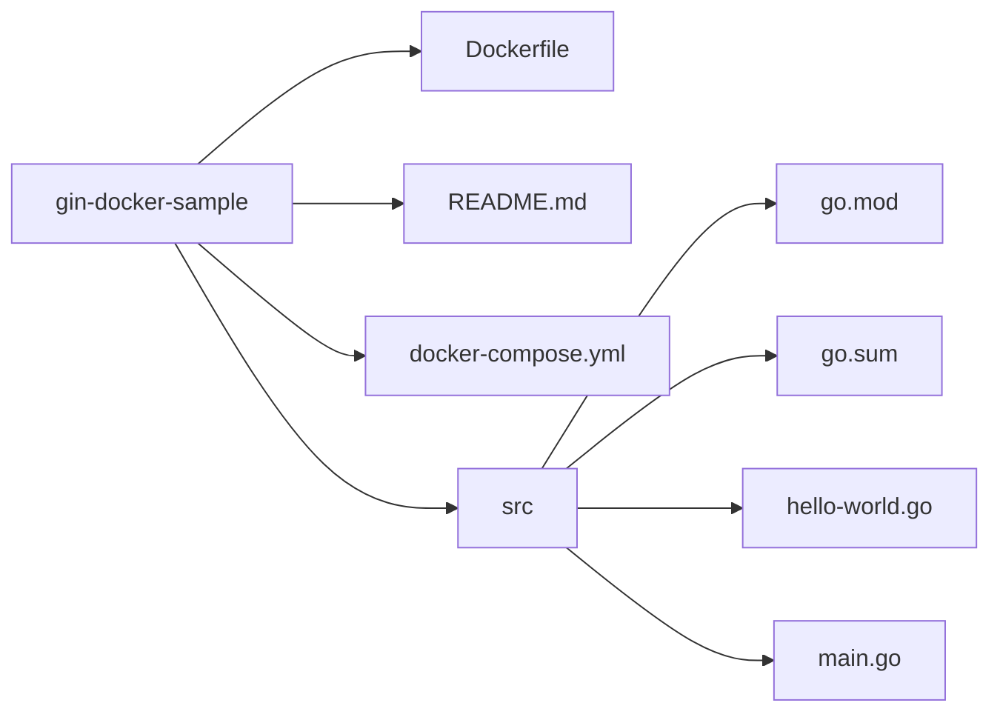

# 実行方法

1. `git clone` したら、 `docker compose build` コマンドでイメージを作成してください。
2. `docker-compose up -d` コマンドでを実行し、ginのサーバーを起動してください。

## ディレクトリ構成

上記のディレクトリ構成を持つことを前提としています。`src` ディレクトリには、ginで使用するファイルが含まれています。